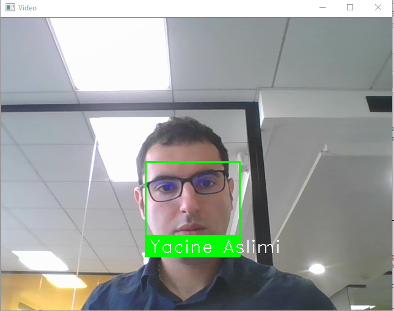
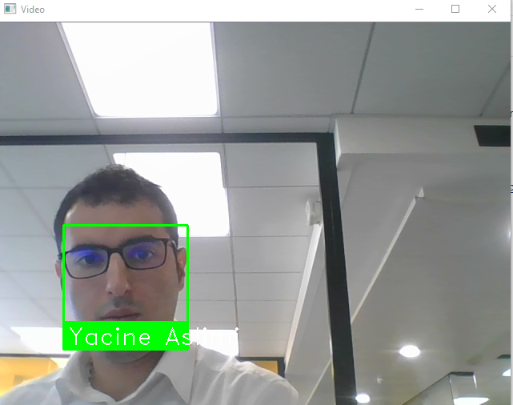

# face_Recognition

A simple introduction to facial recognition with Python.
In this repo, you will find the ipython notebook with the three images used in this tutorial.

<table><td></td><td></td></table>

